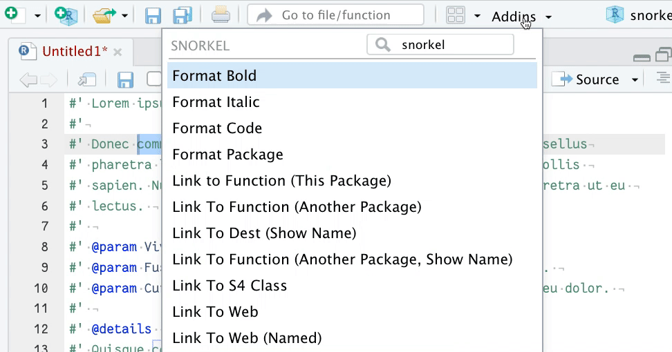

<!-- README.md is generated from README.Rmd. Please edit that file -->

```{r, include = FALSE}
knitr::opts_chunk$set(
  collapse = TRUE,
  comment = "#>",
  fig.path = "man/figures/README-",
  out.width = "100%"
)
```

# {snorkel}

<!-- badges: start -->
[](https://www.repostatus.org/#wip)
[](https://github.com/matt-dray/snorkel/actions)
<!-- badges: end -->

An R package of RStudio Addins to help you [insert {roxygen2} formatting](https://roxygen2.r-lib.org/) to your function documentation.

You put a snorkel in your mouth to help you breathe oxygen; you put a {snorkel} in your addins to help you write with {roxygen2}.

The package aims to cover [often-used roxygen formatting tags](https://roxygen2.r-lib.org/articles/formatting.html). Learn more on the [Writing R extensions](https://cran.r-project.org/doc/manuals/R-exts.html#Marking-text) site. I notice that [Jozef has also created something](https://gitlab.com/jozefhajnala/jhaddins) along these lines.

## Deep breath

Install from Github with:

```{r install, eval=FALSE}
install.packages("remotes")  # if not already installed
remotes::install_github("matt-dray/snorkel")
```

After installation, you may need to restart R. Then you can access the {snorkel} functions from the 'Addins' menu in RStudio.

## Dive in

Select some text in your functions script and choose from the addins the appropriate function for your needs. If you want to make a word bold, highlight it and then choose 'Format Bold' from the addin. This will change the text from `This is bold` to `This is \strong{bold}`, for example.

Special cases are 'Link To Function (Another Package)' or 'Link To Function (Another Package, Show Name)'. Both need as input the package name and the function name that you're linking to. To do this, type this like 'package::function', select it and choose the the function you want from the addins menu.

Note that the 'List' functions will insert an example, rather than replacing any selected text.

<div class="figure">

</div>
